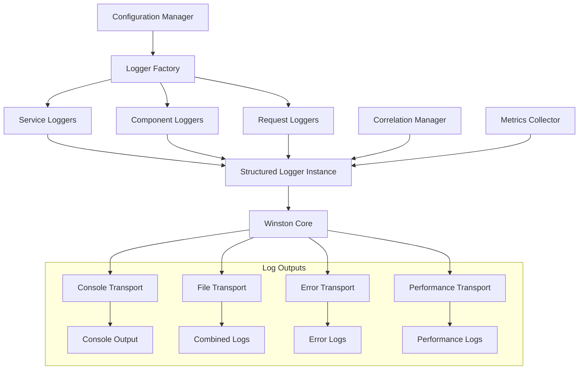

# Centralized Logging System Design

## Overview

The centralized logging system will provide a unified, structured logging solution for the entire AIGens backend application. Building upon the existing Winston-based logging infrastructure in the model-management system, this design extends comprehensive logging capabilities across all application components including API routes, services, controllers, middleware, and scripts.

The system will support three verbosity levels ("very-verbose", "verbose", "only-important-info"), provide correlation ID tracking for request tracing, and maintain organized log files with automatic rotation. The design emphasizes developer experience with drop-in replacements for existing console logging while providing advanced features like performance monitoring and audit logging.

## Architecture

### Core Components



### Directory Structure

```
services/
├── logging/
│   ├── index.js                    # Main export and factory
│   ├── core/
│   │   ├── structured-logger.js    # Enhanced StructuredLogger class
│   │   ├── logger-factory.js       # Logger creation and management
│   │   ├── correlation-manager.js  # Request correlation tracking
│   │   └── metrics-collector.js    # Performance and usage metrics
│   ├── config/
│   │   ├── logging-config.js       # Centralized logging configuration
│   │   ├── verbosity-levels.js     # Verbosity level definitions
│   │   └── transport-config.js     # Winston transport configurations
│   ├── middleware/
│   │   ├── request-logger.js       # Express middleware for request logging
│   │   └── correlation-middleware.js # Correlation ID middleware
│   ├── utils/
│   │   ├── log-formatter.js        # Custom log formatting utilities
│   │   ├── file-manager.js         # Log file organization and rotation
│   │   └── error-handler.js        # Logging error handling
│   └── adapters/
│       ├── console-adapter.js      # Console.log replacement
│       └── legacy-adapter.js       # Backward compatibility
```

## Components and Interfaces

### Logger Factory

The Logger Factory serves as the central point for creating and managing logger instances across the application.

```javascript
// services/logging/core/logger-factory.js
class LoggerFactory {
  constructor(config) {
    this.config = config;
    this.loggers = new Map();
    this.correlationManager = new CorrelationManager();
    this.metricsCollector = new MetricsCollector();
  }

  // Create or retrieve logger for a service/component
  getLogger(service, component = null, context = {}) {
    const key = `${service}:${component || 'default'}`;
    
    if (!this.loggers.has(key)) {
      const logger = new StructuredLogger({
        service,
        component,
        config: this.config,
        context,
        correlationManager: this.correlationManager,
        metricsCollector: this.metricsCollector
      });
      this.loggers.set(key, logger);
    }
    
    return this.loggers.get(key);
  }

  // Create child logger with additional context
  createChildLogger(parentLogger, context = {}) {
    return parentLogger.child(context);
  }

  // Get logger with automatic service/component detection
  getAutoLogger(context = {}) {
    const caller = this.detectCaller();
    return this.getLogger(caller.service, caller.component, context);
  }
}
```

### Enhanced Structured Logger

Building upon the existing model-management logger, the enhanced version will support the new verbosity levels and additional features.

```javascript
// services/logging/core/structured-logger.js
class StructuredLogger extends BaseStructuredLogger {
  constructor(options = {}) {
    super(options);
    this.verbosityLevel = options.verbosityLevel || this.config.verbosityLevel;
    this.correlationManager = options.correlationManager;
    this.metricsCollector = options.metricsCollector;
  }

  // Enhanced logging methods with verbosity awareness
  debug(message, context = {}) {
    if (this.isVerbosityEnabled('debug')) {
      super.debug(message, this.enrichContext(context));
    }
  }

  info(message, context = {}) {
    if (this.isVerbosityEnabled('info')) {
      super.info(message, this.enrichContext(context));
    }
  }

  // New convenience methods
  request(method, url, context = {}) {
    this.http(`${method} ${url}`, {
      type: 'request',
      method,
      url,
      ...context
    });
  }

  response(status, duration, context = {}) {
    this.http(`Response ${status}`, {
      type: 'response',
      status,
      duration,
      durationHuman: this.formatDuration(duration),
      ...context
    });
  }

  // Audit logging
  audit(action, user, context = {}) {
    this.info(`Audit: ${action}`, {
      type: 'audit',
      action,
      user,
      timestamp: new Date().toISOString(),
      ...context
    });
  }
}
```

### Verbosity Level Configuration

```javascript
// services/logging/config/verbosity-levels.js
const VERBOSITY_LEVELS = {
  'very-verbose': {
    levels: ['error', 'warn', 'info', 'http', 'verbose', 'debug', 'silly'],
    description: 'Maximum logging for development and debugging',
    fileLevel: 'debug',
    consoleLevel: 'debug'
  },
  'verbose': {
    levels: ['error', 'warn', 'info', 'http'],
    description: 'Standard operational logging',
    fileLevel: 'info',
    consoleLevel: 'info'
  },
  'only-important-info': {
    levels: ['error', 'warn'],
    description: 'Production logging - errors and warnings only',
    fileLevel: 'warn',
    consoleLevel: 'error'
  }
};

function getVerbosityConfig(level = 'verbose') {
  return VERBOSITY_LEVELS[level] || VERBOSITY_LEVELS.verbose;
}
```

### Request Correlation Middleware

```javascript
// services/logging/middleware/correlation-middleware.js
function correlationMiddleware(options = {}) {
  const headerName = options.headerName || 'x-correlation-id';
  
  return (req, res, next) => {
    // Extract or generate correlation ID
    let correlationId = req.headers[headerName];
    
    if (!correlationId) {
      correlationId = generateCorrelationId();
    }
    
    // Store in request context
    req.correlationId = correlationId;
    
    // Set response header
    res.setHeader(headerName, correlationId);
    
    // Set in logger context
    req.logger = loggerFactory.getLogger('api', 'request', {
      correlationId,
      method: req.method,
      url: req.url,
      userAgent: req.headers['user-agent']
    });
    
    next();
  };
}
```

### Console Adapter for Legacy Support

```javascript
// services/logging/adapters/console-adapter.js
class ConsoleAdapter {
  constructor(logger) {
    this.logger = logger;
  }

  log(...args) {
    this.logger.info(this.formatArgs(args));
  }

  error(...args) {
    this.logger.error(this.formatArgs(args));
  }

  warn(...args) {
    this.logger.warn(this.formatArgs(args));
  }

  info(...args) {
    this.logger.info(this.formatArgs(args));
  }

  debug(...args) {
    this.logger.debug(this.formatArgs(args));
  }

  formatArgs(args) {
    return args.map(arg => 
      typeof arg === 'object' ? JSON.stringify(arg, null, 2) : String(arg)
    ).join(' ');
  }
}

// Global console replacement
function replaceConsole(logger) {
  const adapter = new ConsoleAdapter(logger);
  global.console = adapter;
}
```

## Data Models

### Log Entry Structure

```javascript
{
  "timestamp": "2025-01-21T10:30:45.123Z",
  "level": "info",
  "service": "api",
  "component": "users",
  "correlationId": "abc123def456",
  "message": "User created successfully",
  "context": {
    "userId": "user_123",
    "email": "user@example.com",
    "ip": "192.168.1.1"
  },
  "metadata": {
    "pid": 12345,
    "hostname": "api-server-01",
    "version": "1.0.0"
  }
}
```

### Performance Log Structure

```javascript
{
  "timestamp": "2025-01-21T10:30:45.123Z",
  "level": "info",
  "service": "api",
  "component": "database",
  "type": "performance",
  "operation": "user_query",
  "duration": 150,
  "durationMs": 150,
  "durationHuman": "150ms",
  "correlationId": "abc123def456",
  "context": {
    "query": "SELECT * FROM users WHERE id = ?",
    "params": ["user_123"],
    "rowCount": 1
  }
}
```

### Audit Log Structure

```javascript
{
  "timestamp": "2025-01-21T10:30:45.123Z",
  "level": "info",
  "service": "api",
  "component": "auth",
  "type": "audit",
  "action": "user_login",
  "user": {
    "id": "user_123",
    "email": "user@example.com"
  },
  "correlationId": "abc123def456",
  "context": {
    "ip": "192.168.1.1",
    "userAgent": "Mozilla/5.0...",
    "success": true
  }
}
```

## Error Handling

### Graceful Degradation Strategy

1. **Transport Failure Handling**
   - If file transport fails, fall back to console only
   - If console transport fails, attempt file logging only
   - If all transports fail, store logs in memory buffer temporarily

2. **Configuration Error Handling**
   - Invalid verbosity levels default to 'verbose'
   - Missing log directories are created automatically
   - Invalid file permissions trigger fallback to alternative locations

3. **Memory Management**
   - Implement log buffer limits to prevent memory leaks
   - Use backpressure mechanisms for high-volume logging
   - Automatic cleanup of old correlation IDs and metrics

### Error Recovery Mechanisms

```javascript
// services/logging/utils/error-handler.js
class LoggingErrorHandler {
  constructor(logger) {
    this.logger = logger;
    this.fallbackBuffer = [];
    this.maxBufferSize = 1000;
  }

  handleTransportError(error, logEntry) {
    // Store in fallback buffer
    if (this.fallbackBuffer.length < this.maxBufferSize) {
      this.fallbackBuffer.push(logEntry);
    }

    // Attempt recovery
    this.attemptRecovery(error);
  }

  attemptRecovery(error) {
    // Implement retry logic with exponential backoff
    setTimeout(() => {
      this.flushFallbackBuffer();
    }, this.calculateRetryDelay());
  }
}
```

## Testing Strategy

### Unit Testing

1. **Logger Factory Tests**
   - Test logger creation and caching
   - Verify service/component detection
   - Test configuration inheritance

2. **Structured Logger Tests**
   - Test all log levels and verbosity filtering
   - Verify context enrichment and correlation ID handling
   - Test performance timing and metrics collection

3. **Middleware Tests**
   - Test correlation ID generation and propagation
   - Verify request/response logging
   - Test error handling in middleware

### Integration Testing

1. **End-to-End Logging Flow**
   - Test complete request lifecycle logging
   - Verify log file creation and rotation
   - Test correlation ID tracking across components

2. **Transport Integration**
   - Test file transport with rotation
   - Verify console output formatting
   - Test error transport separation

3. **Configuration Testing**
   - Test different verbosity levels
   - Verify environment-specific configurations
   - Test configuration hot-reloading

### Performance Testing

1. **High-Volume Logging**
   - Test logging performance under load
   - Verify memory usage remains stable
   - Test log rotation under high volume

2. **Correlation ID Performance**
   - Test correlation tracking with concurrent requests
   - Verify no memory leaks in correlation storage
   - Test cleanup of expired correlations

## Migration Strategy

### Phase 1: Core Infrastructure
- Implement enhanced StructuredLogger
- Create LoggerFactory and configuration system
- Set up basic file organization and rotation

### Phase 2: Middleware Integration
- Implement correlation middleware
- Create request/response logging
- Add console adapter for legacy support

### Phase 3: Service Integration
- Replace console.log usage in services
- Add structured logging to controllers
- Implement audit logging for sensitive operations

### Phase 4: Advanced Features
- Add performance monitoring
- Implement metrics collection
- Create monitoring dashboards integration

### Backward Compatibility

- Maintain existing model-management logging functionality
- Provide console adapter for gradual migration
- Support both old and new logging patterns during transition
- Create migration utilities for bulk console.log replacement