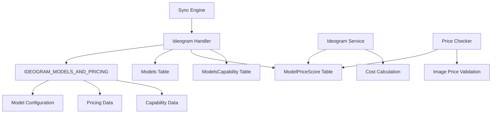

# Design Document

## Overview

This design enhances the Ideogram model management system to fully integrate with the existing model management infrastructure. The enhancement focuses on proper pricing configuration using the `price_image` field, capability mapping, and service integration for Ideogram's image generation models. The design leverages the existing sync engine architecture while adding Ideogram-specific handling for pricing and capabilities.

## Architecture

### System Integration Points



### Data Flow

1. **Sync Engine** calls `fetchIdeogramModels()` to get model configuration from `IDEOGRAM_MODELS_AND_PRICING`
2. **Transform** converts configuration to database format
3. **Database Sync** populates `models`, `models_price_score`, and capability tables
4. **Service Layer** retrieves pricing from database for cost calculations
5. **Price Checker** validates image pricing using `price_image` field

## Components and Interfaces

### 1. Sync Engine Enhancement

**File**: `services/model-management/automation/sync-engine.js`

**Enhanced Methods**:
- `fetchIdeogramModels()`: Returns models from `IDEOGRAM_MODELS_AND_PRICING` configuration
- `transformIdeogramModel()`: Converts configuration to database format
- `validateIdeogramModel()`: Validates model data structure

**New Functionality**:
- Populates `models_price_score` table with image pricing
- Creates capability relationships for all Ideogram models
- Uses manual pricing source ("ideogram-manual")

### 2. Pricing Integration

**Price Storage Format**:
```json
{
  "Generate": "0.06",
  "Remix": "0.06", 
  "Edit": "0.06",
  "Reframe": "0.06",
  "Replace BG": "0.06"
}
```

**Database Schema**:
- `models_price_score.price_image`: JSON string containing operation-specific pricing
- `models_price_score.source`: Set to "ideogram-manual"
- `models_price_score.price_1m_input_tokens`: Set to 0 (not applicable for images)
- `models_price_score.price_1m_output_tokens`: Set to 0 (not applicable for images)

### 3. Service Layer Enhancement

**File**: `services/ideogram.service.js`

**Enhanced Methods**:
- `calculateCost()`: Retrieves pricing from `models_price_score.price_image`
- Cost calculation uses operation-specific pricing from JSON
- Maintains existing API call functionality unchanged

**New API Endpoints Support**:
- `/generate`: Text-to-image generation
- `/remix`: Image-to-image generation with reference
- `/edit`: Image editing with masks
- `/reframe`: Aspect ratio changes
- `/replace-background`: Background replacement
- `/describe`: Image description

### 4. Price Validation Enhancement

**File**: `check-price-scores.js`

**Enhanced Functionality**:
- Detects image models by checking for `price_image` field
- Validates JSON structure in `price_image`
- Reports pricing completeness for image models
- Separate validation logic for image vs text models

## Data Models

### Model Configuration Structure

```javascript
const IDEOGRAM_MODELS_AND_PRICING = [
  {
    "model_slug": "ideogram-v3-ideogram",
    "name": "Ideogram V3",
    "display_name": "Ideogram V3",
    "api_model_id": "ideogram-v3",
    "rendering_speed": "DEFAULT",
    "generate": "0.06",
    "remix": "0.06",
    "edit": "0.06",
    "reframe": "0.06",
    "replace-background": "0.06"
  }
  // ... additional models
];
```

### Capability Configuration

```javascript
const ideogram_capabilities = [
  { name: 'Image input', type: 'input'},
  { name: 'Image generation', type: 'vision'},
  { name: 'Image editing', type: 'vision'},
  { name: 'Image input', type: 'input'}
];
```

### Database Transformations

**Models Table**:
```sql
INSERT INTO models (
  id_provider,
  model_slug,
  api_model_id,
  name,
  display_name,
  description,
  max_tokens,
  is_active,
  has_stats_aa
) VALUES (
  ideogram_provider_id,
  'ideogram-v3-ideogram',
  'ideogram-v3',
  'Ideogram V3',
  'Ideogram V3',
  'High-quality image generation model',
  0,
  true,
  false
);
```

**Models Price Score Table**:
```sql
INSERT INTO models_price_score (
  id_model,
  price_image,
  price_1m_input_tokens,
  price_1m_output_tokens,
  source
) VALUES (
  model_id,
  '{"Generate": "0.06", "Remix": "0.06", "Edit": "0.06", "Reframe": "0.06", "Replace BG": "0.06"}',
  0,
  0,
  'ideogram-manual'
);
```

## Error Handling

### Sync Engine Error Handling

1. **Missing Configuration**: Log warning and skip model if configuration is incomplete
2. **Database Errors**: Rollback transaction and retry with exponential backoff
3. **Capability Mapping Errors**: Log warning but continue with model creation
4. **Pricing Data Errors**: Use fallback pricing and log error

### Service Layer Error Handling

1. **Missing Pricing Data**: Use fallback pricing with warning log
2. **Invalid JSON in price_image**: Parse error handling with default pricing
3. **Database Connection Issues**: Graceful degradation with cached pricing
4. **API Endpoint Errors**: Maintain existing error handling patterns

### Price Validation Error Handling

1. **Invalid JSON Structure**: Report specific parsing errors
2. **Missing Operations**: Report incomplete pricing coverage
3. **Invalid Price Values**: Validate numeric values and ranges
4. **Database Query Errors**: Handle connection issues gracefully

## Testing Strategy

### Unit Tests

1. **Sync Engine Tests**:
   - Test `fetchIdeogramModels()` returns correct configuration
   - Test `transformIdeogramModel()` converts data properly
   - Test pricing data population in `models_price_score`
   - Test capability relationship creation

2. **Service Layer Tests**:
   - Test cost calculation with different operations
   - Test pricing retrieval from database
   - Test fallback pricing mechanisms
   - Test API endpoint method additions

3. **Price Validation Tests**:
   - Test image model detection
   - Test JSON parsing and validation
   - Test error reporting for invalid data
   - Test integration with existing text model validation

### Integration Tests

1. **End-to-End Sync Test**:
   - Run complete sync process for Ideogram
   - Verify all models are created with correct data
   - Verify pricing and capabilities are properly set
   - Test sync idempotency

2. **Service Integration Test**:
   - Test cost calculation using real database data
   - Test API calls with proper pricing
   - Test error scenarios and fallbacks

3. **Price Validation Integration**:
   - Test price checker with mixed model types
   - Test reporting accuracy for image models
   - Test performance with large datasets

### Performance Tests

1. **Sync Performance**:
   - Measure sync time for all Ideogram models
   - Test memory usage during sync process
   - Test concurrent sync operations

2. **Service Performance**:
   - Measure cost calculation response time
   - Test database query performance
   - Test caching effectiveness

## Implementation Phases

### Phase 1: Sync Engine Enhancement
- Update `fetchIdeogramModels()` to use configuration data
- Enhance `transformIdeogramModel()` for proper data mapping
- Add pricing population logic
- Add capability relationship creation

### Phase 2: Service Layer Integration
- Update `calculateCost()` to use database pricing
- Add support for new API endpoints (structure only)
- Implement JSON pricing parsing
- Add fallback mechanisms

### Phase 3: Price Validation Enhancement
- Add image model detection logic
- Implement JSON validation for `price_image`
- Add reporting for image model pricing
- Integrate with existing validation flow

### Phase 4: Testing and Validation
- Comprehensive testing of all components
- Performance optimization
- Error handling validation
- Documentation updates

## Security Considerations

1. **Data Validation**: Validate all pricing data before database insertion
2. **SQL Injection Prevention**: Use parameterized queries for all database operations
3. **Configuration Security**: Ensure pricing configuration is not externally modifiable
4. **API Security**: Maintain existing API security patterns for new endpoints

## Monitoring and Observability

1. **Sync Monitoring**: Log sync operations with correlation IDs
2. **Pricing Accuracy**: Monitor pricing calculation accuracy
3. **Performance Metrics**: Track sync duration and database query performance
4. **Error Tracking**: Comprehensive error logging with context

## Backward Compatibility

1. **Existing Models**: No impact on existing non-Ideogram models
2. **API Compatibility**: All existing API endpoints remain unchanged
3. **Database Schema**: Additive changes only, no breaking modifications
4. **Service Interfaces**: Maintain existing method signatures