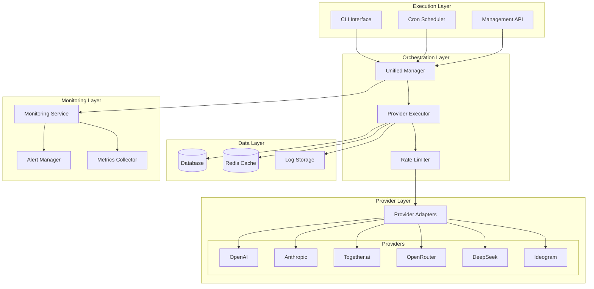

# Design Document

## Overview

The Model Management System will be redesigned as a unified, automated solution for synchronizing AI model data from multiple providers. The system will consolidate the current separate initialization and update scripts into a cohesive architecture that supports both manual execution and automated cronjob scheduling.

The design focuses on:
- Unified provider interface pattern
- Robust error handling and retry mechanisms
- Comprehensive logging and monitoring
- Flexible execution modes (all providers, specific providers, dry-run)
- Automated daily synchronization via cronjobs
- Proper handling of aggregated model relationships

## Architecture

### High-Level Architecture



### Core Components

#### 1. Unified Manager
- Central orchestrator for all model management operations
- Handles execution modes (init, update, sync)
- Manages provider selection and sequencing
- Coordinates error handling and recovery

#### 2. Provider Adapters
- Standardized interface for each AI provider
- Handles API-specific authentication and request formatting
- Implements provider-specific retry logic and rate limiting
- Manages fallback data when APIs are unavailable

#### 3. Model Processor
- Processes raw provider data into standardized format
- Handles model deduplication and conflict resolution
- Manages aggregated model relationships
- Updates pricing and metadata information

#### 4. Monitoring and Alerting
- Real-time monitoring of script execution
- Alert generation for failures and anomalies
- Performance metrics collection
- Health check endpoints

## Components and Interfaces

### Provider Interface

All provider adapters will implement a standardized interface:

```javascript
interface ProviderAdapter {
  // Provider identification
  name: string;
  type: 'direct' | 'aggregator';
  
  // Core methods
  async fetchModels(): Promise<RawModel[]>;
  async validateApiKey(): Promise<boolean>;
  formatModel(rawModel: any): StandardModel;
  
  // Configuration
  getConfig(): ProviderConfig;
  getFallbackModels(): StandardModel[];
  
  // Health and monitoring
  async healthCheck(): Promise<HealthStatus>;
  getMetrics(): ProviderMetrics;
}
```

### Standard Model Format

```javascript
interface StandardModel {
  model_id: string;
  model_slug: string;
  api_model_id: string;
  id_provider: number;
  name: string;
  description: string;
  max_tokens: number;
  is_active: boolean;
  pricing?: PricingInfo;
  capabilities?: string[];
  metadata?: ModelMetadata;
}
```

### Execution Context

```javascript
interface ExecutionContext {
  mode: 'init' | 'update' | 'sync';
  providers: string[];
  options: {
    dryRun: boolean;
    force: boolean;
    skipValidation: boolean;
    batchSize: number;
  };
  logger: Logger;
  metrics: MetricsCollector;
}
```

## Data Models

### Enhanced Model Schema

The existing model schema will be extended to support better tracking:

```sql
-- Add columns to existing models table
ALTER TABLE models ADD COLUMN last_updated_at TIMESTAMP DEFAULT CURRENT_TIMESTAMP;
ALTER TABLE models ADD COLUMN sync_status ENUM('pending', 'synced', 'failed') DEFAULT 'pending';
ALTER TABLE models ADD COLUMN sync_error TEXT NULL;
ALTER TABLE models ADD COLUMN metadata JSON NULL;

-- New table for tracking sync operations
CREATE TABLE model_sync_logs (
  id INT PRIMARY KEY AUTO_INCREMENT,
  provider_name VARCHAR(50) NOT NULL,
  sync_type ENUM('init', 'update', 'full_sync') NOT NULL,
  started_at TIMESTAMP NOT NULL,
  completed_at TIMESTAMP NULL,
  status ENUM('running', 'completed', 'failed') NOT NULL,
  models_processed INT DEFAULT 0,
  models_created INT DEFAULT 0,
  models_updated INT DEFAULT 0,
  errors_count INT DEFAULT 0,
  error_details JSON NULL,
  execution_time_ms INT NULL,
  created_at TIMESTAMP DEFAULT CURRENT_TIMESTAMP
);

-- New table for provider health monitoring
CREATE TABLE provider_health_status (
  id INT PRIMARY KEY AUTO_INCREMENT,
  provider_name VARCHAR(50) NOT NULL,
  last_check_at TIMESTAMP NOT NULL,
  status ENUM('healthy', 'degraded', 'unhealthy') NOT NULL,
  response_time_ms INT NULL,
  error_message TEXT NULL,
  consecutive_failures INT DEFAULT 0,
  created_at TIMESTAMP DEFAULT CURRENT_TIMESTAMP,
  updated_at TIMESTAMP DEFAULT CURRENT_TIMESTAMP ON UPDATE CURRENT_TIMESTAMP,
  UNIQUE KEY unique_provider (provider_name)
);
```

## Error Handling

### Error Classification

1. **Transient Errors** (retry with backoff)
   - Network timeouts
   - Rate limiting (429)
   - Temporary API unavailability (5xx)

2. **Configuration Errors** (fail fast)
   - Invalid API keys
   - Missing required configuration
   - Database connection failures

3. **Data Errors** (log and continue)
   - Invalid model data format
   - Constraint violations
   - Duplicate key errors

### Retry Strategy

```javascript
const retryConfig = {
  maxRetries: 3,
  initialDelay: 2000,
  maxDelay: 30000,
  factor: 2,
  jitter: 0.1,
  retryableErrors: [
    'ECONNRESET',
    'ETIMEDOUT',
    'ENOTFOUND',
    'HTTP_429',
    'HTTP_5XX'
  ]
};
```

### Circuit Breaker Pattern

Implement circuit breaker for each provider to prevent cascading failures:

```javascript
const circuitBreakerConfig = {
  failureThreshold: 5,
  resetTimeout: 60000,
  monitoringPeriod: 30000
};
```

## Testing Strategy

### Unit Tests
- Provider adapter functionality
- Model formatting and validation
- Error handling scenarios
- Retry logic verification

### Integration Tests
- End-to-end provider synchronization
- Database operations and transactions
- API endpoint testing
- Cronjob execution simulation

### Performance Tests
- Large dataset processing
- Concurrent provider updates
- Memory usage optimization
- Database query performance

### Test Data Management
- Mock provider responses
- Test database fixtures
- Isolated test environments
- Automated test data cleanup

## Deployment and Operations

### Cronjob Configuration

```bash
# Daily model sync at 2 AM
0 2 * * * /usr/bin/node /path/to/scripts/model-management/sync-all-models.js --mode=update

# Health check every 15 minutes
*/15 * * * * /usr/bin/node /path/to/scripts/model-management/health-check.js

# Weekly full sync on Sundays at 1 AM
0 1 * * 0 /usr/bin/node /path/to/scripts/model-management/sync-all-models.js --mode=full-sync
```

### Monitoring and Alerting

1. **Metrics to Track**
   - Sync success/failure rates
   - Processing time per provider
   - Number of models added/updated
   - API response times
   - Error frequencies

2. **Alert Conditions**
   - Sync failures for any provider
   - Significant increase in new models (>50)
   - API response time degradation
   - Consecutive health check failures

3. **Notification Channels**
   - Email alerts for critical failures
   - Slack notifications for warnings
   - Dashboard updates for metrics

### Configuration Management

Centralized configuration in `config/model-management.js`:

```javascript
module.exports = {
  providers: {
    openai: {
      enabled: true,
      apiUrl: 'https://api.openai.com/v1/models',
      timeout: 30000,
      rateLimit: { requests: 100, window: 60000 }
    },
    // ... other providers
  },
  sync: {
    batchSize: 50,
    maxConcurrency: 3,
    defaultTimeout: 300000
  },
  monitoring: {
    healthCheckInterval: 900000, // 15 minutes
    alertThresholds: {
      failureRate: 0.1,
      responseTime: 10000
    }
  }
};
```

### Logging Strategy

Structured logging with different levels:

```javascript
const logLevels = {
  ERROR: 'Critical failures requiring immediate attention',
  WARN: 'Non-critical issues that should be monitored',
  INFO: 'General operational information',
  DEBUG: 'Detailed execution information for troubleshooting'
};
```

Log rotation and retention:
- Daily log rotation
- 30-day retention for INFO/WARN/ERROR
- 7-day retention for DEBUG
- Compressed archive storage