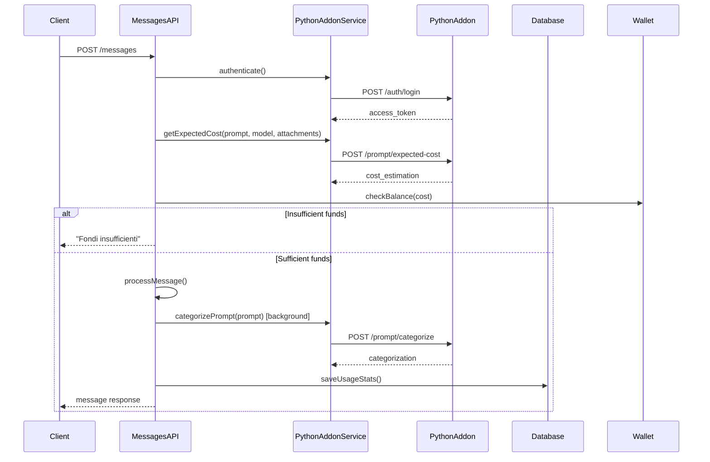

# Design Document

## Overview

The Python addon integration will enhance the existing messages API by adding accurate cost estimation and usage analytics. The integration consists of a new service for communicating with the Python addon, modifications to the message processing flow, and background collection of usage statistics.

## Architecture

### High-Level Flow



## Components and Interfaces

### 1. PythonAddonService

A new service class that handles all communication with the Python addon API.

**Location:** `services/python-addon.service.js`

**Key Methods:**
- `authenticate()` - Authenticates with the Python addon and manages token lifecycle
- `getExpectedCost(prompt, model, calculationMethod, selectorModel, attachmentCount, verbose)` - Gets cost estimation
- `categorizePrompt(prompt, verbose)` - Gets prompt categorization (background operation)

**Token Management:**
- Stores access token and refresh token in memory
- Automatically refreshes tokens when expired
- Handles authentication errors gracefully

### 2. Modified Messages API

**Location:** `api/v1/messages.js`

**Changes:**
- Add cost estimation call before processing (line 665 area)
- Replace existing cost estimation logic (lines 685-713) with Python addon service call
- Add background prompt categorization after message processing
- Store usage statistics in models_stats_usage table

### 3. Usage Statistics Collection

**Database Table:** `models_stats_usage`

**Data Collection Points:**
- Input token count from cost estimation
- Output token count from AI service response
- Task categories from prompt categorization
- Response time measurement
- Expected vs effective costs
- Attachment information

## Data Models

### Python Addon API Requests

**Authentication Request:**
```json
{
  "username": "API_PYTHON_ADDON_USERNAME",
  "password": "API_PYTHON_ADDON_PASSWORD"
}
```

**Cost Estimation Request:**
```json
{
  "prompt": "string",
  "model": "string",
  "calculation_method": "categories",
  "selector_model": "Qwen/Qwen2.5-7B-Instruct-Turbo",
  "number_of_attachments": 0,
  "verbose": false
}
```

**Categorization Request:**
```json
{
  "prompt": "string",
  "verbose": false
}
```

### Python Addon API Responses

**Authentication Response:**
```json
{
  "access_token": "string",
  "expires_in": 3600,
  "refresh_token": "string",
  "status": "success"
}
```

**Cost Estimation Response:**
```json
{
  "cost_estimation": {
    "estimated_output_tokens": 1050,
    "expected_costs": {
      "currency": "EUR",
      "total_cost_tokens": 0.632,
      "model_found": "string",
      "model_id": 1,
      "model_name": "string"
    }
  },
  "status": "success"
}
```

**Categorization Response:**
```json
{
  "categorization": {
    "anthropic_categories": ["category1", "category2"],
    "task_complexity": "medium",
    "task_topic": ["topic1", "topic2"],
    "task_type": ["TEXT"]
  },
  "status": "success"
}
```

## Error Handling

### Error Types and Messages

1. **Insufficient Funds:** "Fondi insufficienti"
2. **Generic Cost Check Error:** "Errore controllo credito"
3. **Model Not Found:** "Model '{model_name}' not found in database"
4. **Authentication Error:** "Errore controllo credito"
5. **Network/Service Error:** "Errore controllo credito"

### Error Handling Strategy

- **Cost Estimation Errors:** Block message processing and return specific error
- **Categorization Errors:** Log error but continue processing (background operation)
- **Authentication Errors:** Retry once, then fail with generic error
- **Network Timeouts:** Use 10-second timeout, fail with generic error

## Testing Strategy

### Unit Tests

1. **PythonAddonService Tests:**
   - Authentication flow (success/failure)
   - Token refresh mechanism
   - Cost estimation API calls
   - Categorization API calls
   - Error handling for each endpoint

2. **Messages API Integration Tests:**
   - Cost estimation integration
   - Balance checking with Python addon costs
   - Usage statistics collection
   - Error message handling

### Integration Tests

1. **End-to-End Flow:**
   - Complete message processing with cost estimation
   - Background categorization and statistics storage
   - Error scenarios (insufficient funds, service unavailable)

2. **Database Integration:**
   - Usage statistics storage
   - Data integrity validation

### Mock Strategy

- Mock Python addon service responses for unit tests
- Use test database for integration tests
- Mock network failures for error handling tests

## Implementation Considerations

### Performance

- **Token Caching:** Store tokens in memory to avoid repeated authentication
- **Background Processing:** Categorization runs asynchronously to not block response
- **Timeout Handling:** 10-second timeout for all Python addon calls
- **Connection Pooling:** Reuse HTTP connections where possible

### Security

- **Credential Storage:** Use environment variables for Python addon credentials
- **Token Security:** Store tokens in memory only, never persist to disk
- **Error Information:** Don't expose internal service details in error messages

### Reliability

- **Retry Logic:** Retry authentication once on failure
- **Graceful Degradation:** Continue processing if categorization fails
- **Circuit Breaker:** Consider implementing if Python addon becomes unreliable

### Monitoring

- **Logging:** Log all Python addon service interactions
- **Metrics:** Track success/failure rates for cost estimation and categorization
- **Alerting:** Alert on repeated Python addon service failures