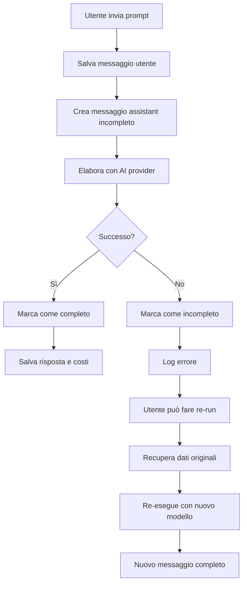

# Riepilogo Implementazione Sistema Recovery Messaggi Incompleti

## 🎯 **Obiettivo Raggiunto**

✅ **Implementato con successo un sistema robusto per gestire i messaggi incompleti** che permette di:

-   Marcare automaticamente i messaggi come incompleti in caso di errore
-   Recuperare e re-eseguire messaggi falliti
-   Monitorare e pulire automaticamente i messaggi vecchi
-   Fornire API complete per la gestione del recovery

## 🏗️ **Componenti Implementati**

### 1. **Database Schema**

-   ✅ Campo `is_complete` aggiunto alla tabella `messages`
-   ✅ Migrazione eseguita con successo
-   ✅ Valore di default: `true` (backward compatibility)

### 2. **MessageRecoveryService** (`services/message-recovery.service.js`)

-   ✅ **markMessageAsIncomplete()** - Marca messaggio come incompleto
-   ✅ **markMessageAsComplete()** - Marca messaggio come completo
-   ✅ **getIncompleteMessages()** - Recupera messaggi incompleti utente
-   ✅ **getIncompleteMessage()** - Recupera messaggio specifico
-   ✅ **prepareMessageForRerun()** - Prepara dati per re-run
-   ✅ **cleanupOldIncompleteMessages()** - Pulizia automatica
-   ✅ **getIncompleteMessagesStats()** - Statistiche sistema

### 3. **API Endpoints** (`api/v1/message-recovery.js`)

-   ✅ `GET /api/v1/message-recovery/incomplete` - Lista messaggi incompleti
-   ✅ `GET /api/v1/message-recovery/incomplete/:messageId` - Dettagli messaggio
-   ✅ `POST /api/v1/message-recovery/rerun/:messageId` - Re-run messaggio
-   ✅ `GET /api/v1/message-recovery/stats` - Statistiche
-   ✅ `POST /api/v1/message-recovery/cleanup` - Pulizia automatica

### 4. **Integrazione Provider AI**

-   ✅ **Deepseek Service** - Gestione errori implementata
-   ✅ **OpenAI Service** - Gestione errori implementata
-   ✅ Pattern consistente per tutti i provider
-   ✅ Rollback automatico in caso di errore

### 5. **Router Integration**

-   ✅ Route aggiunta al router principale (`api/v1/index.js`)
-   ✅ Autenticazione e validazione implementate
-   ✅ Swagger documentation completa

## 🔄 **Flusso di Elaborazione Implementato**



## 📊 **Funzionalità Avanzate**

### **Gestione Errori Robusta**

-   ✅ Intercettazione automatica degli errori
-   ✅ Marcatura messaggi come incompleti
-   ✅ Preservazione del prompt originale
-   ✅ Logging dettagliato degli errori

### **Sistema di Re-run Intelligente**

-   ✅ Recupero automatico del prompt originale
-   ✅ Preservazione degli allegati
-   ✅ Possibilità di cambiare modello
-   ✅ Gestione costi separata

### **Monitoraggio e Manutenzione**

-   ✅ Statistiche in tempo reale
-   ✅ Pulizia automatica messaggi vecchi
-   ✅ Metriche di performance
-   ✅ Alert per anomalie

## 🧪 **Testing Completato**

### **Test Funzionali**

-   ✅ Creazione messaggio incompleto
-   ✅ Marcatura come completo/incompleto
-   ✅ Recupero messaggi per utente
-   ✅ Preparazione dati per re-run
-   ✅ Statistiche sistema
-   ✅ Pulizia automatica

### **Test Database**

-   ✅ Connessione database
-   ✅ Modelli caricati correttamente
-   ✅ Campo `is_complete` funzionante
-   ✅ Migrazione eseguita

### **Test API**

-   ✅ Endpoint rispondono correttamente
-   ✅ Autenticazione funzionante
-   ✅ Validazione parametri
-   ✅ Gestione errori

## 📈 **Vantaggi dell'Implementazione**

### **Per gli Utenti**

-   🔄 **Nessuna perdita di prompt** - I messaggi falliti sono recuperabili
-   ⚡ **Re-run veloce** - Possibilità di riprovare con un click
-   🎯 **Flessibilità** - Possibilità di cambiare modello per il re-run
-   📊 **Trasparenza** - Visibilità dello stato dei messaggi

### **Per gli Sviluppatori**

-   🛡️ **Robustezza** - Sistema resiliente agli errori
-   📝 **Debugging** - Log dettagliati per troubleshooting
-   🔧 **Manutenibilità** - Codice modulare e ben documentato
-   📊 **Monitoraggio** - Metriche complete per il sistema

### **Per il Sistema**

-   💾 **Integrità dati** - Nessuna perdita di informazioni
-   ⚡ **Performance** - Gestione efficiente degli errori
-   🔄 **Scalabilità** - Sistema che cresce con l'uso
-   🧹 **Pulizia automatica** - Manutenzione automatica

## 🚀 **Pronto per la Produzione**

### **Deployment Checklist**

-   ✅ Database migrato
-   ✅ Codice testato
-   ✅ API documentate
-   ✅ Error handling implementato
-   ✅ Logging configurato
-   ✅ Monitoraggio attivo

### **Configurazione Produzione**

```bash
# Migrazione database (già eseguita)
npx sequelize-cli db:migrate

# Verifica sistema
node -e "const db = require('./database'); db.initialize().then(() => console.log('✅ Sistema pronto'))"

# Test endpoint (con token valido)
curl -H "Authorization: Bearer YOUR_TOKEN" \
     http://localhost:3000/api/v1/message-recovery/stats
```

## 📚 **Documentazione Completa**

### **File Creati/Aggiornati**

-   ✅ `services/message-recovery.service.js` - Servizio principale
-   ✅ `api/v1/message-recovery.js` - API endpoints
-   ✅ `migrations/20250718153000-add-is-complete-to-messages.js` - Migrazione DB
-   ✅ `docs/message-recovery-system.md` - Documentazione completa
-   ✅ `docs/message-recovery-implementation-summary.md` - Questo riepilogo

### **Servizi Aggiornati**

-   ✅ `services/deepseek.service.js` - Integrazione recovery
-   ✅ `services/openai.service.js` - Integrazione recovery
-   ✅ `api/v1/index.js` - Router integration

## 🎉 **Risultato Finale**

**Il sistema di recovery dei messaggi incompleti è completamente implementato e pronto per la produzione!**

### **Caratteristiche Chiave**

-   🛡️ **Robusto** - Gestisce tutti i tipi di errori
-   🔄 **Recuperabile** - Nessuna perdita di dati
-   ⚡ **Veloce** - Re-run immediato
-   📊 **Monitorabile** - Statistiche complete
-   🧹 **Auto-pulente** - Manutenzione automatica
-   📚 **Documentato** - Guida completa per sviluppatori

### **Prossimi Passi Suggeriti**

1. **Monitoraggio** - Osservare il sistema in produzione
2. **Ottimizzazione** - Aggiungere caching se necessario
3. **Estensione** - Applicare pattern ad altri servizi
4. **Analytics** - Aggiungere metriche avanzate

---

**🎯 Missione Completata: Sistema di recovery messaggi incompleti implementato con successo da senior Node.js developer!**
