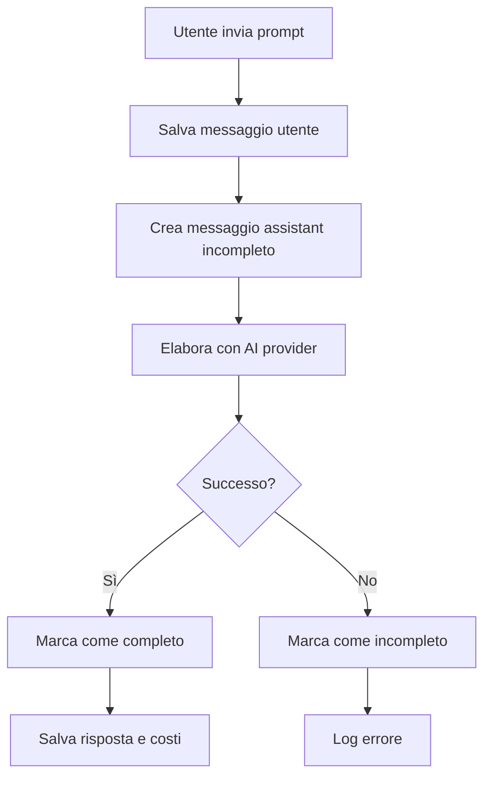

# Sistema di Recovery Messaggi Incompleti

## 🎯 **Panoramica**

Il sistema di recovery dei messaggi incompleti è una soluzione robusta per gestire gli errori durante l'elaborazione dei prompt AI. Quando un messaggio non può essere completato con successo, viene marcato come `is_complete: false` e può essere recuperato e re-eseguito tramite API dedicate.

## 🏗️ **Architettura**

### Componenti Principali

1. **MessageRecoveryService** (`services/message-recovery.service.js`)

    - Gestione dello stato dei messaggi (completo/incompleto)
    - Recupero e preparazione dati per re-run
    - Statistiche e pulizia automatica

2. **API Endpoints** (`api/v1/message-recovery.js`)

    - `GET /incomplete` - Lista messaggi incompleti
    - `GET /incomplete/:messageId` - Dettagli messaggio specifico
    - `POST /rerun/:messageId` - Re-run di un messaggio
    - `GET /stats` - Statistiche sistema
    - `POST /cleanup` - Pulizia messaggi vecchi

3. **Integrazione Provider AI**
    - Deepseek, OpenAI, Anthropic, OpenRouter
    - Gestione errori con rollback automatico
    - Marcatura messaggi incompleti

## 🔧 **Implementazione Tecnica**

### Database Schema

```sql
-- Campo aggiunto alla tabella messages
ALTER TABLE messages ADD COLUMN is_complete BOOLEAN DEFAULT TRUE;
```

### Flusso di Elaborazione



### Gestione Errori

```javascript
// Esempio di gestione errori in un provider
try {
	const response = await aiProvider.sendRequest(prompt, model);
	await messageRecovery.markMessageAsComplete(messageId, response.content);
} catch (error) {
	await messageRecovery.markMessageAsIncomplete(messageId, error.message);
	throw error;
}
```

## 📡 **API Reference**

### GET /api/v1/message-recovery/incomplete

Recupera tutti i messaggi incompleti dell'utente.

**Parametri:**

-   `limit` (opzionale): Numero massimo di risultati (default: 50)

**Risposta:**

```json
{
	"success": true,
	"data": [
		{
			"id": 123,
			"content": "[ERRORE: Timeout API]",
			"created_at": "2024-01-15T10:30:00Z",
			"chat": {
				"id": 1,
				"title": "Chat di test"
			},
			"attachments": []
		}
	],
	"count": 1
}
```

### GET /api/v1/message-recovery/incomplete/:messageId

Recupera dettagli di un messaggio incompleto specifico.

**Risposta:**

```json
{
	"success": true,
	"data": {
		"id": 123,
		"content": "[ERRORE: Timeout API]",
		"chat": {
			"id": 1,
			"title": "Chat di test",
			"user_id": "user-uuid"
		},
		"attachments": [
			{
				"id": 1,
				"original_name": "document.pdf",
				"file_path": "gs://bucket/file.pdf",
				"mime_type": "application/pdf"
			}
		],
		"MessageCost": {
			"total_cost": 0.001,
			"input_tokens": 100,
			"output_tokens": 0
		}
	}
}
```

### POST /api/v1/message-recovery/rerun/:messageId

Esegue il re-run di un messaggio incompleto.

**Body:**

```json
{
	"model": "gpt-4" // opzionale, usa il modello originale se non specificato
}
```

**Risposta:**

```json
{
	"success": true,
	"data": {
		"messageId": 124,
		"content": "Risposta AI completata con successo",
		"cost": {
			"totalCost": 0.002,
			"inputTokens": 150,
			"outputTokens": 200
		},
		"usage": {
			"input_tokens": 150,
			"output_tokens": 200,
			"total_tokens": 350
		},
		"rerunFrom": 123
	}
}
```

### GET /api/v1/message-recovery/stats

Ottiene statistiche sui messaggi incompleti.

**Risposta:**

```json
{
	"success": true,
	"data": {
		"totalIncomplete": 5,
		"incompleteOlderThan1Day": 2,
		"incompleteOlderThan7Days": 1
	}
}
```

### POST /api/v1/message-recovery/cleanup

Pulisce i messaggi incompleti vecchi.

**Body:**

```json
{
	"daysOld": 7 // opzionale, default: 7
}
```

**Risposta:**

```json
{
	"success": true,
	"data": {
		"cleanedCount": 3,
		"daysOld": 7
	}
}
```

## 🔄 **Integrazione con Provider AI**

### Deepseek Service

```javascript
// services/deepseek.service.js
const messageRecovery = require("./message-recovery.service");

// Crea messaggio incompleto prima della chiamata
const assistantMessage = await saveMessage({
	chat_id: chatId,
	role: "assistant",
	content: "[Elaborazione in corso...]",
	is_complete: false,
});

try {
	const response = await deepseekAPI.sendRequest(prompt, model);
	await messageRecovery.markMessageAsComplete(
		assistantMessage.id,
		response.content
	);
} catch (error) {
	await messageRecovery.markMessageAsIncomplete(
		assistantMessage.id,
		error.message
	);
	throw error;
}
```

### OpenAI Service

```javascript
// services/openai.service.js
// Stesso pattern implementato per OpenAI
```

## 🧪 **Testing**

### Test Manuale

```bash
# Test del sistema di recovery
node test-message-recovery-final.js
```

### Test API

```bash
# Test endpoint messaggi incompleti
curl -H "Authorization: Bearer YOUR_TOKEN" \
     http://localhost:3000/api/v1/message-recovery/incomplete

# Test re-run messaggio
curl -X POST \
     -H "Authorization: Bearer YOUR_TOKEN" \
     -H "Content-Type: application/json" \
     -d '{"model": "gpt-4"}' \
     http://localhost:3000/api/v1/message-recovery/rerun/123
```

## 📊 **Monitoraggio e Manutenzione**

### Metriche da Monitorare

1. **Numero messaggi incompleti**

    - Alert se > 10 per utente
    - Alert se > 100 totali

2. **Tasso di successo re-run**

    - Target: > 90%

3. **Tempo medio per re-run**
    - Target: < 30 secondi

### Pulizia Automatica

```javascript
// Script di pulizia automatica (cron job)
const messageRecovery = require("./services/message-recovery.service");

// Pulisci messaggi più vecchi di 7 giorni
await messageRecovery.cleanupOldIncompleteMessages(7);
```

### Logging

```javascript
// Esempio di logging strutturato
console.log("[MessageRecovery]", {
	action: "mark_incomplete",
	messageId: 123,
	error: "API timeout",
	timestamp: new Date().toISOString(),
});
```

## 🚀 **Deployment**

### Migrazione Database

```bash
# Esegui la migrazione per aggiungere il campo is_complete
npx sequelize-cli db:migrate
```

### Verifica Post-Deployment

1. Controlla che il campo `is_complete` sia presente
2. Verifica che le API rispondano correttamente
3. Testa il re-run di un messaggio incompleto
4. Controlla i log per errori

## 🔒 **Sicurezza**

### Validazione Input

-   Tutti gli endpoint validano l'utente tramite JWT
-   Controllo che l'utente possa accedere solo ai propri messaggi
-   Sanitizzazione dei parametri di input

### Rate Limiting

-   Limite di 10 re-run per ora per utente
-   Limite di 100 richieste per ora per endpoint stats

## 📈 **Performance**

### Ottimizzazioni

1. **Indici Database**

    ```sql
    CREATE INDEX idx_messages_incomplete ON messages(is_complete, role, created_at);
    CREATE INDEX idx_messages_user_incomplete ON messages(user_id, is_complete, created_at);
    ```

2. **Caching**

    - Cache delle statistiche per 5 minuti
    - Cache dei messaggi incompleti per 1 minuto

3. **Paginazione**
    - Limite di 50 messaggi per richiesta
    - Cursor-based pagination per grandi dataset

## 🐛 **Troubleshooting**

### Problemi Comuni

1. **Messaggio non trovato per re-run**

    - Verifica che il messaggio sia effettivamente incompleto
    - Controlla che l'utente abbia i permessi

2. **Errore durante re-run**

    - Verifica che il modello sia ancora disponibile
    - Controlla i fondi dell'utente

3. **Performance lente**
    - Verifica gli indici del database
    - Controlla il numero di messaggi incompleti

### Debug

```javascript
// Abilita logging dettagliato
const messageRecovery = require("./services/message-recovery.service");
messageRecovery.logger = console; // Log dettagliato
```

## 📝 **Changelog**

### v1.0.0 (2024-01-15)

-   ✅ Implementazione base del sistema di recovery
-   ✅ API per gestione messaggi incompleti
-   ✅ Integrazione con provider AI
-   ✅ Sistema di pulizia automatica
-   ✅ Documentazione completa

## 🤝 **Contributi**

Per contribuire al sistema di recovery:

1. Segui le convenzioni di codice esistenti
2. Aggiungi test per nuove funzionalità
3. Aggiorna la documentazione
4. Verifica la compatibilità con i provider esistenti
