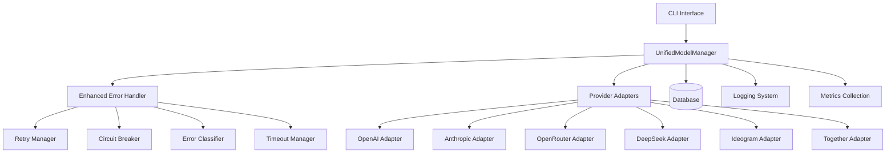

# Unified Model Manager Documentation

The Unified Model Manager is a comprehensive orchestration system for managing AI model synchronization across multiple providers. It provides a centralized interface for initializing, updating, and synchronizing model data with enhanced error handling, monitoring, and provider coordination.

## Table of Contents

- [Overview](#overview)
- [Architecture](#architecture)
- [Features](#features)
- [Installation & Setup](#installation--setup)
- [Usage](#usage)
- [Configuration](#configuration)
- [CLI Interface](#cli-interface)
- [API Reference](#api-reference)
- [Error Handling](#error-handling)
- [Monitoring & Logging](#monitoring--logging)
- [Testing](#testing)
- [Best Practices](#best-practices)
- [Troubleshooting](#troubleshooting)

## Overview

The Unified Model Manager addresses the complexity of managing AI models from multiple providers by providing:

- **Centralized Orchestration**: Single interface for all provider operations
- **Intelligent Scheduling**: Multiple execution strategies (sequential, parallel, mixed)
- **Robust Error Handling**: Comprehensive retry logic, circuit breakers, and timeout management
- **Provider Health Monitoring**: Real-time health checks and status tracking
- **Dry-Run Capability**: Test operations without database changes
- **Comprehensive Logging**: Detailed logging and metrics collection

## Architecture

### Core Components



### Provider Types

- **Direct Providers**: Connect directly to provider APIs (OpenAI, Anthropic, DeepSeek, Ideogram, Together)
- **Aggregator Providers**: Aggregate multiple providers (OpenRouter)

### Execution Modes

1. **INIT**: Initial setup, create all models from scratch
2. **UPDATE**: Update existing models and add new ones
3. **SYNC**: Full synchronization with cleanup of stale models

### Execution Strategies

1. **SEQUENTIAL**: Process providers one by one
2. **PARALLEL**: Process providers concurrently
3. **MIXED**: Parallel aggregators, sequential direct providers

## Features

### Enhanced Error Handling

- **Retry Logic**: Exponential backoff with jitter
- **Circuit Breakers**: Prevent cascading failures
- **Timeout Management**: Multiple timeout levels with graceful degradation
- **Error Classification**: Intelligent error categorization and handling

### Provider Management

- **Health Monitoring**: Continuous provider health checks
- **Dependency Management**: Handle provider dependencies
- **Fallback Mechanisms**: Use cached/fallback data when APIs are unavailable

### Database Operations

- **Batch Processing**: Efficient batch processing of large datasets
- **Transaction Safety**: Database operations wrapped in transactions
- **Model Deduplication**: Prevent duplicate models
- **Pricing Data Management**: Comprehensive pricing information handling

### Monitoring & Observability

- **Comprehensive Logging**: Structured logging with multiple levels
- **Metrics Collection**: Performance and reliability metrics
- **Health Status**: Real-time system health reporting
- **Execution Summaries**: Detailed execution reports

## Installation & Setup

### Prerequisites

- Node.js 16+
- MySQL database
- Provider API keys

### Environment Variables

```bash
# Provider API Keys
OPENAI_API_KEY=your-openai-key
ANTHROPIC_API_KEY=your-anthropic-key
TOGETHER_API_KEY=your-together-key
OPENROUTER_API_KEY=your-openrouter-key
DEEPSEEK_API_KEY=your-deepseek-key

# Database Configuration
DB_HOST=localhost
DB_USER=username
DB_PASSWORD=password
DB_NAME=database_name
```

### Database Setup

Ensure your database has the required tables:

- `providers` - Provider registry
- `models` - Model definitions
- `models_price_score` - Pricing and performance data

## Usage

### Programmatic Usage

```javascript
const { UnifiedModelManager, EXECUTION_MODES } = require('./services/model-management/unified-model-manager');

// Initialize manager
const manager = new UnifiedModelManager({
  config: {
    strategy: 'mixed',
    maxConcurrency: 3,
    batchSize: 50
  },
  dryRun: false
});

// Initialize system
await manager.initialize();

// Execute update for all providers
const result = await manager.execute(EXECUTION_MODES.UPDATE);

// Execute for specific providers
const result = await manager.execute(EXECUTION_MODES.SYNC, {
  providers: ['openai', 'anthropic'],
  force: false
});
```

### CLI Usage

The CLI provides a convenient interface for common operations:

```bash
# Basic update
node scripts/model-management/unified-sync.js update

# Initialize specific providers
node scripts/model-management/unified-sync.js init --providers openai,anthropic

# Dry-run synchronization
node scripts/model-management/unified-sync.js sync --dry-run

# Parallel execution with high concurrency
node scripts/model-management/unified-sync.js update --strategy parallel --concurrency 5

# Force execution with debug logging
node scripts/model-management/unified-sync.js sync --force --log-level debug
```

## Configuration

### Manager Configuration

```javascript
const config = {
  // Execution settings
  strategy: 'mixed',           // sequential | parallel | mixed
  maxConcurrency: 3,           // Max concurrent providers
  batchSize: 50,               // Models per batch
  
  // Timeout settings
  providerTimeout: 300000,     // 5 minutes per provider
  totalTimeout: 1800000,       // 30 minutes total
  
  // Retry settings
  maxProviderRetries: 2,       // Retry attempts per provider
  retryDelay: 30000,           // Initial retry delay
  
  // Health check settings
  healthCheckTimeout: 30000,   // Health check timeout
  skipUnhealthyProviders: true,// Skip unhealthy providers
  
  // Database settings
  transactionTimeout: 120000,  // Transaction timeout
  
  // Logging settings
  logLevel: 'info',            // debug | info | warn | error
  enableMetrics: true          // Enable metrics collection
};
```

### Provider Configuration

Each provider has specific configuration:

```javascript
const PROVIDER_CONFIGS = {
  openai: {
    type: 'direct',
    priority: 1,
    timeout: 120000,
    dependsOn: []
  },
  openrouter: {
    type: 'aggregator',
    priority: 3,
    timeout: 300000,
    dependsOn: ['openai', 'anthropic']
  }
};
```

## CLI Interface

### Commands

```bash
unified-sync [mode] [options]
```

### Modes

- `init` - Initialize all models from scratch
- `update` - Update existing models and add new ones (default)
- `sync` - Full synchronization with cleanup

### Options

| Option | Description | Default |
|--------|-------------|---------|
| `--providers <list>` | Comma-separated provider list | All available |
| `--strategy <strategy>` | Execution strategy | mixed |
| `--concurrency <num>` | Max concurrent providers | 3 |
| `--timeout <ms>` | Provider timeout | 300000 |
| `--batch-size <num>` | Batch size for processing | 50 |
| `--dry-run` | Simulate without changes | false |
| `--force` | Force unhealthy providers | false |
| `--skip-health-check` | Skip health check | false |
| `--log-level <level>` | Logging level | info |

### Examples

```bash
# Development testing
unified-sync update --providers openai,anthropic --dry-run --log-level debug

# Production synchronization
unified-sync sync --strategy mixed --concurrency 2 --timeout 600000

# Emergency recovery
unified-sync init --force --skip-health-check --concurrency 1
```

## API Reference

### UnifiedModelManager Class

#### Constructor

```javascript
new UnifiedModelManager(options)
```

**Parameters:**
- `options.config` - Manager configuration object
- `options.logger` - Logger instance
- `options.metrics` - Metrics collector
- `options.dryRun` - Enable dry-run mode

#### Methods

##### initialize()

Initialize the manager and provider adapters.

```javascript
await manager.initialize()
```

##### execute(mode, options)

Execute model management operation.

```javascript
const result = await manager.execute(EXECUTION_MODES.UPDATE, {
  providers: ['openai', 'anthropic'],
  force: false,
  skipHealthCheck: false,
  strategy: 'mixed',
  maxConcurrency: 3
})
```

##### performHealthCheck()

Perform health check on all providers.

```javascript
const healthStatus = await manager.performHealthCheck()
```

##### getStatus()

Get comprehensive system status.

```javascript
const status = manager.getStatus()
```

##### cleanup()

Cleanup resources and close connections.

```javascript
await manager.cleanup()
```

### Execution Result

```javascript
{
  executionId: 'unique-id',
  mode: 'update',
  strategy: 'mixed',
  dryRun: false,
  duration: 123456,
  summary: {
    totalProviders: 5,
    successfulProviders: 4,
    failedProviders: 1,
    totalModelsProcessed: 150,
    totalModelsCreated: 10,
    totalModelsUpdated: 140,
    providers: {
      'openai': {
        success: true,
        duration: 30000,
        modelsProcessed: 50,
        modelsCreated: 5,
        modelsUpdated: 45
      }
    }
  }
}
```

## Error Handling

The system implements comprehensive error handling:

### Error Classification

- **Network Errors**: Connection issues, timeouts
- **Authentication Errors**: Invalid API keys
- **Rate Limit Errors**: API quota exceeded
- **Server Errors**: Provider service issues
- **Validation Errors**: Invalid data format

### Retry Logic

- **Exponential Backoff**: Increasing delays between retries
- **Jitter**: Random variation to prevent thundering herd
- **Selective Retrying**: Only retry appropriate error types

### Circuit Breakers

- **Failure Threshold**: Open circuit after consecutive failures
- **Recovery Testing**: Periodic attempts to recover
- **State Management**: CLOSED → OPEN → HALF_OPEN → CLOSED

### Timeout Management

- **Cascading Timeouts**: Request → Operation → Total
- **Graceful Degradation**: Fallback strategies on timeout
- **Adaptive Timeouts**: Adjust based on historical performance

## Monitoring & Logging

### Logging Levels

- **DEBUG**: Detailed execution information
- **INFO**: General operational information
- **WARN**: Non-critical issues
- **ERROR**: Critical failures

### Metrics

The system collects various metrics:

- **Execution Metrics**: Duration, success rates
- **Provider Metrics**: Health status, response times
- **Error Metrics**: Error rates, failure patterns
- **Performance Metrics**: Throughput, latency

### Health Status

```javascript
{
  overall: 'HEALTHY',
  providers: {
    'openai': {
      state: 'CLOSED',
      isHealthy: true,
      consecutiveFailures: 0
    }
  },
  components: {
    retryManager: { ... },
    timeoutManager: { ... }
  }
}
```

## Testing

### Unit Tests

Run comprehensive unit tests:

```bash
npm test services/model-management/
```

### Integration Tests

Test full system integration:

```bash
npm test __tests__/services/model-management/unified-model-manager.test.js
```

### CLI Tests

Test command-line interface:

```bash
npm test __tests__/scripts/model-management/unified-sync.test.js
```

### Test Coverage

The system includes extensive test coverage:

- **Unit Tests**: Individual component testing
- **Integration Tests**: End-to-end workflow testing
- **Error Scenario Tests**: Failure mode testing
- **Performance Tests**: Load and stress testing

## Best Practices

### Configuration

1. **Use appropriate concurrency** - Balance performance vs. resource usage
2. **Set realistic timeouts** - Account for provider response times
3. **Configure health checks** - Enable proactive failure detection
4. **Use dry-run mode** - Test changes before applying

### Monitoring

1. **Monitor health status** - Track provider health regularly
2. **Review execution logs** - Analyze patterns and issues
3. **Set up alerting** - Get notified of critical failures
4. **Track metrics** - Monitor performance trends

### Error Handling

1. **Use fallback strategies** - Implement graceful degradation
2. **Configure appropriate retries** - Balance resilience vs. latency
3. **Monitor circuit breakers** - Track failure patterns
4. **Handle rate limits** - Respect provider limitations

### Database Operations

1. **Use batch processing** - Improve performance for large datasets
2. **Monitor transaction sizes** - Avoid long-running transactions
3. **Handle conflicts gracefully** - Implement proper conflict resolution
4. **Regular cleanup** - Remove stale data periodically

## Troubleshooting

### Common Issues

#### Provider Health Check Failures

**Symptoms**: Providers marked as unhealthy
**Causes**: 
- Invalid API keys
- Network connectivity issues
- Provider service outages

**Solutions**:
- Verify API key configuration
- Check network connectivity
- Monitor provider status pages
- Use `--force` flag to bypass health checks temporarily

#### High Error Rates

**Symptoms**: Many failed provider executions
**Causes**:
- Rate limiting
- Invalid credentials
- Service degradation

**Solutions**:
- Reduce concurrency
- Implement exponential backoff
- Check API quotas and limits
- Review error logs for patterns

#### Database Connection Issues

**Symptoms**: Database operation failures
**Causes**:
- Connection pool exhaustion
- Long-running transactions
- Database server issues

**Solutions**:
- Monitor connection pool usage
- Reduce batch sizes
- Check database server health
- Review transaction timeouts

#### Memory Usage Issues

**Symptoms**: High memory consumption
**Causes**:
- Large datasets
- Memory leaks
- Inefficient processing

**Solutions**:
- Reduce batch sizes
- Monitor memory usage
- Use streaming processing
- Regular garbage collection

### Debugging Tips

1. **Enable debug logging**: Use `--log-level debug`
2. **Use dry-run mode**: Test without database changes
3. **Monitor health status**: Check provider health regularly
4. **Review execution summaries**: Analyze success/failure patterns
5. **Check circuit breaker states**: Monitor failure protection

### Performance Optimization

1. **Tune concurrency**: Balance throughput vs. resource usage
2. **Optimize batch sizes**: Find optimal processing chunks
3. **Configure timeouts**: Set appropriate timeout values
4. **Monitor metrics**: Track performance trends
5. **Use caching**: Implement appropriate caching strategies

### Recovery Procedures

#### Provider Recovery

```bash
# Reset provider circuit breakers
unified-sync update --providers openai --force --skip-health-check

# Gradual recovery with reduced concurrency
unified-sync update --concurrency 1 --timeout 600000
```

#### Database Recovery

```bash
# Initialize from scratch (use with caution)
unified-sync init --force --batch-size 10

# Partial recovery for specific providers
unified-sync sync --providers openai,anthropic --dry-run
```

#### System Recovery

```bash
# Health check all providers
unified-sync update --skip-health-check --log-level debug

# Force execution with minimal resources
unified-sync update --force --concurrency 1 --timeout 900000
```

## Support

For additional support:

1. Check the logs for detailed error information
2. Review the health status for system state
3. Consult the troubleshooting section
4. Check provider documentation for API changes
5. Monitor provider status pages for outages

The Unified Model Manager provides a robust, scalable solution for managing AI model synchronization across multiple providers with comprehensive error handling, monitoring, and operational capabilities.